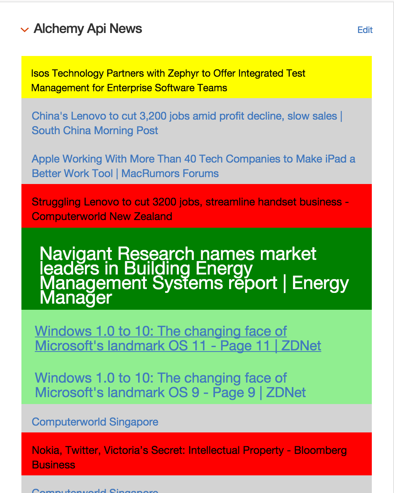

# AlchemyAPI News Widget #

# Before You Begin

This code requires an AlchemyAPI Key. If you do not have one, you can
get a limited key by registering
[here](http://www.alchemyapi.com/api/register.html).  The limited key
is free and has generous resource limits (though you might get banned
if you abuse these limits, so excercise caution and read the
[Terms of Service](http://www.alchemyapi.com/company/terms.html)).

# Description and Use #

This widget provides a listing of news items about a given company.
The data is provided by the AlchemyNews API, which allows you to query
news sources for specific entities and relationships rather than just
keywords.  A full description of the AlchemyNews API is beyond the
scope of this widget, but if you want to know more you can do that
[here](http://docs.alchemyapi.com/docs/getting-started-1)

The widget requires an endpoint named [NewsAlchemyAPI](endpoint.erb)
to be added. This endpoint hits the Alchemy News API and processess
the data before it can be displayed in the [widget](widget.erb).

