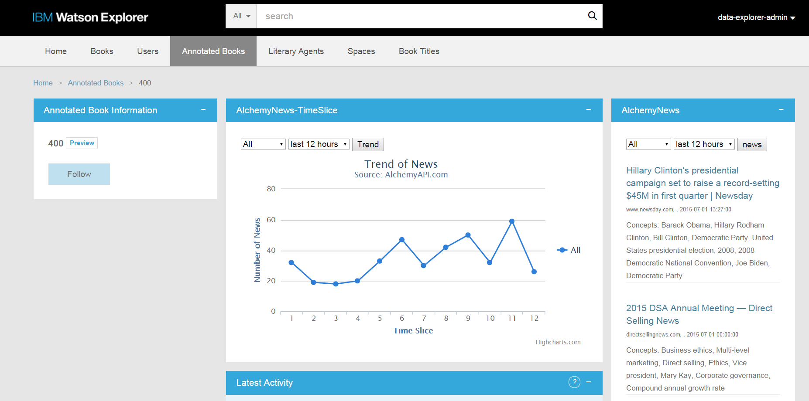

# Integrating the Watson Developer Cloud AlchemyAPI News Service with Watson Explorer

[IBM Watson Explorer](http://www.ibm.com/smarterplanet/us/en/ibmwatson/explorer.html) combines search and content analytics with unique cognitive computing capabilities available through external cloud services such as [Watson Developer Cloud](http://www.ibm.com/smarterplanet/us/en/ibmwatson/developercloud/) to help users find and understand the information they need to work more efficiently and make better, more confident decisions.

The [AlchemyAPI](http://www.alchemyapi.com/) Data News API offers sophisticated search over a curated dataset of news and blogs that has been enriched with AlchemyAPI's text analysis. In this tutorial, we demonstrate development of two Watson Explorer Application Builder widgets that leverage the AlchemyAPI News API to produce a 360 degree application that allows end-users to keep their fingers on the pulse of their entities. There are additional cognitive functions available via the AlchemyAPI service in Bluemix.  The full AlchemyAPI reference is available on the [AlchemyAPI website](http://www.alchemyapi.com/api).

The goal of this tutorial is to demonstrate how to get started with an integration between Watson Explorer and the Watson AlchemyAPI service available on IBM Watson Developer Cloud. By the end of the tutorial you will have enhanced the example-appbuilder application with a news widget that provides links to recent news articles and blog updates relevant to individual entities, as well as a trend widget that provides a visualization of the frequency with which individual entities appear in the news.

## Prerequisites
Please read "[Introduction to the Watson Developer Cloud for Application Builder Administrators](https://github.com/IBM-Watson/wex-appbuilder-samples/blob/master/intro-to-bluemix-for-app-builder.md)" for an overview of the integration architecture and information on tools and libraries for required to work with Bluemix.

- An [IBM Bluemix](https://ace.ng.bluemix.net/) account
- [Watson Explorer](http://www.ibm.com/smarterplanet/us/en/ibmwatson/explorer.html) - Installed, configured, and running
- Completion of the Watson Explorer [AppBuilder tutorial](http://www.ibm.com/support/knowledgecenter/SS8NLW_11.0.0/com.ibm.swg.im.infosphere.dataexpl.appbuilder.doc/c_de-ab-devapp-tutorial.html)
- The [Application Builder proxy](https://github.com/Watson-Explorer/wex-wdc-integration-samples/tree/master/proxy) up and running.
- An API key from the [AlchemyAPI website](http://www.alchemyapi.com/products/alchemydata-news).  Note that an API Key can be obtained from either the Alchemy website or IBM Bluemix.

## What's Included in this Tutorial

This tutorial will walk through the creation and deployment of two components.

1. Watson Explorer App Builder endpoints that will call out to AlchemyData News APIs.
2. Watson Explorer App Builder widgets that use the created endpoints.
  - The news article widget sends displays a list of top news articles with sentiment for a given keyword search.
  - The news trend widget counts the number of news articles for a search term with a given sentiment and plots the results as a graph.

If you are using Watson Explorer < 11.0, please see [the AlchemyData News examples that demonstrate the use of Watson Explorer Application Builder with the sample web proxy](https://github.com/IBM-Watson/wex-wdc-AlchemyAPI-news).

## Step-by-Step Tutorial

This section outlines the steps required to deploy custom Watson AlchemyAPI News endpoints and widgets in Application Builder.

### Obtain an Alchemy API Key

For instructions to obtain an API key directly from the AlchemyAPI website see: [http://www.alchemyapi.com/api/register.html](http://www.alchemyapi.com/api/register.html)

For instructions to obtain an API key through IBM Bluemix see: [https://console.ng.bluemix.net/catalog/alchemyapi/](https://console.ng.bluemix.net/catalog/alchemyapi/)

Please note.

* A Bluemix application is not required to be created or bound to the Alchemy service in Bluemix to use it.  This is ideal for basic use cases and quickly getting started.
* All basic API keys are rate limited by requests/minute and total requests/day.

### Configure Watson Explorer Application Builder

This example includes two widgets.  both custom widgets require the use of the App Builder Endpoints feature.  If you are using a version of Watson Explorer < 11.0, you will need to install and configure the [WEX App Builder Sample Proxy](https://github.com/IBM-Watson/wex-appbuilder-sample-proxy) which is out of scope for this example.

#### Configure Endpoints (WEX 11+)

Two sample endpoints are provided, one for the text based list widget and another for the news sentiment trend widget.

**News List Endpoint**

This endpoint will search AlchemyData News and return summarized snippets of the top `N` news articles.

1. From the Application Builder Admin console, navigate to the Endpoints section and create an Endpoint named `alchemy_news_list`.
2. Add the following parameters with sample text to the endpoint.
  - end
      * now
  - query
      * |text=ibm|
  - sentiment
      * positive
  - start
      * now-7d
  - max
      * 5
3. Copy the code from [news-list-endpoint.rb](/alchemy_news/ApplicationBuilder/news-list-endpoint.rb)
4. Update the API key in the endpoint to use your API key by replacing the text `YOUR_API_KEY_HERE`.
5. Test the endpoint
6. Save it.

**News Sentiment Trend Endpoint**

This endpoint will search AlchemyData News and return a computed histogram of news articles for a given time period so they can be graphed.

1. From the Application Builder Admin console, navigate to the Endpoints section and create an Endpoint named `alchemy_news_trends`.
2. Add the following parameters with sample text to the endpoint.
  - end
     * now
  - query
     * |text=ibm|
  - sentiment
     * positive
  - start
     * now-7d
  - timeslice
     * 1d
3. Copy the code from [news-trend-endpoint.rb](/alchemy_news/ApplicationBuilder/news-trend-endpoint.rb)
4. Update the API key in the endpoint to use your API key by replacing the text `YOUR_API_KEY_HERE`.
5. Test the endpoint
6. Save it.

#### Configuring the News Trend Widget

The purpose of this example widget is to perform a AlchemyData News API search for the entity name and display a graphical trend of news sentiment.  The results of the AlchemyData News search are displayed in the Application Builder UI.  Controls are provided to modify the news search.

Once you have logged into the Application Builder administrative interface, follow these steps to create the custom widget and add it to the Book Title entity.

1. Navigate to the Pages & Widgets -> Book Title -> detail page.
2. Create a new Custom widget.
3. Set the ID of the widget to be `alchemy_news_api_list`
4. Set the Display name of the widget to be `AlchemyData News Search`
5. Copy and paste the [code for this widget](appbuilder/alchemy-news-list-widget.erb) into the Type-specific Configuration.
6. Save the widget.
7. Go back to the Book Title > detail page.
8. Drag the `WDC_AlchemyAPI_News` widget to the top of the right column and save the page configuration.

#### Configuring the News List Widget

The purpose of this example widget is to display a graph of the number of news results.  This news visualization allows your end-users to quickly see whether an entity is trending in the news.

1. Navigate to the Pages & Widgets -> Book Title -> detail page.
2. Create a new Custom widget.
3. Set the ID of the widget to be `alchemy_news_api`
4. Set the Display name of the widget to be `AlchemyData News Trend`
5. Copy and paste the [code for this widget](appbuilder/alchemy-news-trend-widget.erb) into the Type-specific Configuration.
6. Save the widget.
7. Go back to the Book Title > detail page.
8. Drag the `WDC_AlchemyAPI_News` widget to the top of the right column and save the page configuration.

Exercise for the reader:  Combine both of the news list and trend widgets into a single flip widget!

# Implementation Considerations

At this point the widget should be fully configured.  However, you may find far more relevant news results for your data if you specify the entity type as part of the news query.  See the AlchemyAPI documentation for [details about using entity types](http://docs.alchemyapi.com/v1.0/docs/entities) as well as [nearly 400 other parameters](http://docs.alchemyapi.com/v1.0/docs/full-list-of-supported-news-api-fields) that can be used to construct sophisticated News API queries.

- **Improved Search Accuracy** - AlchemyData provides [nearly 400 other parameters](http://docs.alchemyapi.com/v1.0/docs/full-list-of-supported-news-api-fields) that can be used to construct sophisticated News API queries.  This sample demonstrates a simple starting query.
- **Privacy and Security** - The AlchemyData News widget makes a web request to the Bluemix application endpoint configured in the Application Builder proxy.  In this example, this call is made over an unencrypted and unauthenticated HTTP connection, but your Bluemix application can be modified to support better security.
- **Failures will happen** - All distributed systems are inherently unreliable and failures will inevitably occur when attempting to call out to Bluemix.  Consider how failures should be handled.
- **Data Preparation** - It is the responsibility of the caller to ensure that representative data is being sent to the AlchemyAPI News API.  Additional data preparation may be required in some cases.  Choose content carefully and be sure you are sending a clean news query.
- **Scalability** - This example uses only a single cloud instance with the default Bluemix application settings.  In a production scenario consider how much hardware will be required and adjust the Bluemix application settings accordingly.

# Licensing
All sample code contained within this project repository or any subdirectories is licensed according to the terms of the MIT license, which can be viewed in the [license](/LICENSE) file.

# Open Source @ IBM
[Find more open source projects on the IBM Github Page](http://ibm.github.io/)
