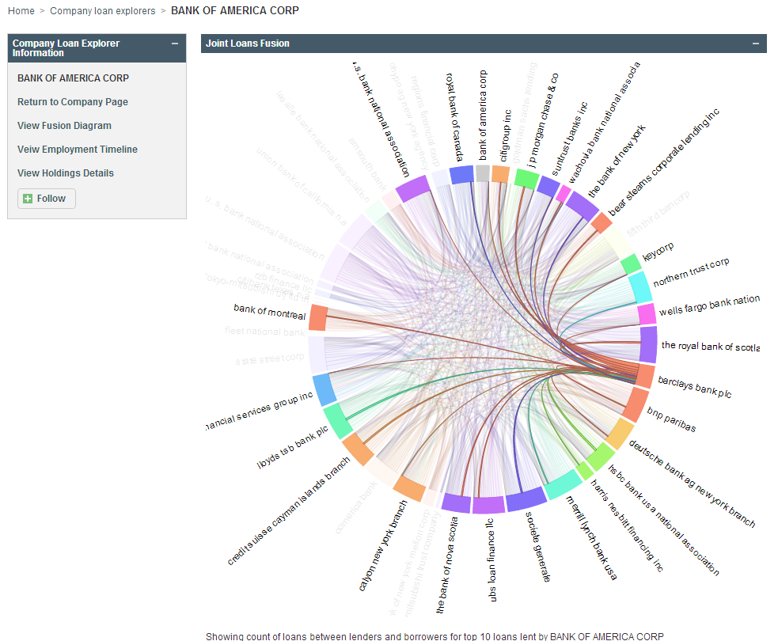

# Name

Chord diagram custom widget

# Description and Use

Chord diagrams (also known as Dependency wheels) are commonly used for
showing entity relationships between small groups of entities. These
relationships cannot be automatically inferred from the data. You
should calculate a facet for each entity in the chart to be the
relationship map. The visualization becomes difficult to read with large
numbers of entries and you shold limit the number of entities shown.

For example, in the loans wheel example, a search was performed for
loan IDs and facet created on the lender names.  This search provides
the count of loans each lender issued to each borrower.  The image hover
shows that Barclays is borrowing from several banks
(multi colored ribbons) and lending to several other banks (orange ribbons).

The code example in [chord_diagram.erb](chord_diagram.erb) requires internet access for the CDN (Content
Delivery Network). In production use, this javascript code should be
referenced locally.
