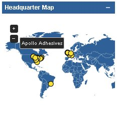

# Coordinate Map #

# Intro #
This widget can be used to visualize GPS coordinates. For any list of documents of a certain entity that contain coordinates, you can get a shiny map.

# How to use #
1. Create a custom widget in an entity list view in AppBuilder and paste the [custom_widget.erb](custom_widget.erb) code into it
2. Download jquery-jvectormap-1.2.2.min.js and jquery-jvectormap-world-mill-en.js from http://jvectormap.com/download/ and place them in your webserver directory (usually /path/to-your-installation/AppBuilder/wlp/usr/servers/AppBuilder/apps/AppBuilder/assets)
3. Replace your-entity with the name of the entity you want to visualize
4. Replace LocationLat and LocationLon with the field names containing latitude and longitude information
