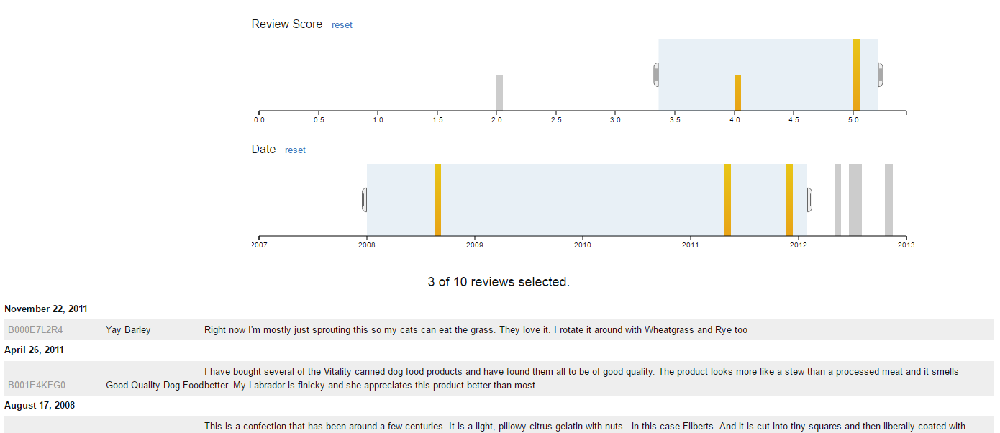

# Crossfilter #

# Description and Use #

This widget uses Crossfilter, which is a JavaScript library for exploring large multivariate datasets in the browser.
Crossfilter supports extremely fast (<30ms) interaction with coordinated views, even with datasets
containing a million or more records.

The data used here comes from a dataset of Amazon Fine Food Reviews. There are two bar charts. One, shows reviews by score.
The other, has reviews by date. Used in combination, you can highlight sections of the charts to filter the corresponding
comments that are shown under them.

The example assumes there is an entity called 'reviews'. CSV sample data is included.
