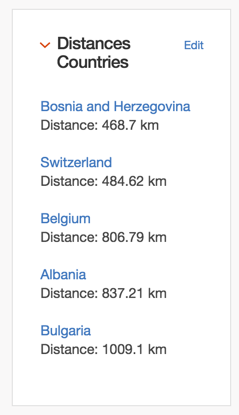

# Display Distances between two points #

# Description and Use #

This example uses a collection called 'Countries' to display a list of
'nearby' countries.  The collection includes the latitude and
longitude of each country, which this widget uses to calculate a
distance form the subject. The widget then takes some number of the
nearest (or most distant) countries and displays them.

This collection was created from the `countries.csv` file found in
this repository.

There are three user-adjustable parameters in the widget.  The first,
`how_many_to_show` sets the number of countries shown in the widget.
The second, `output_format` defines the distance output format.  This
can be in miles, feet, meters, kilometers, or rods.  The last
parameter, `near_or_far` tells the widget to sort by nearest or most
distant.

The code uses the
[haversine distance formula](https://en.wikipedia.org/wiki/Haversine_formula)
to do the distance calculation.  There is also a JavaScript
implementation in the file [haversine.js](haversine.js) provided for
convenience.

