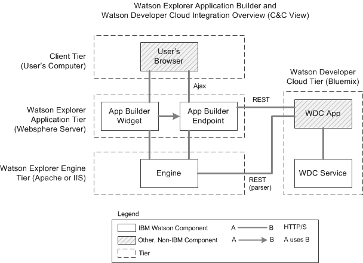

# Introduction the Watson Developer Cloud for Appliation Builder Admins  

[IBM Watson Explorer](http://www.ibm.com/smarterplanet/us/en/ibmwatson/explorer.html) combines search and content analytics with unique cognitive computing capabilities offered by the Watson Developer Cloud to help users find and understand the information they need to work more efficiently and make better, more confident decisions.  Watson Explorer Application Builder is the delivery tool that allows developers to quickly construct a 360-degree view combining data and analytics from many sources into a single view. These applications can be enhanced using content from external sources, external visualization libraries (such as D3.js), and external APIs. Integrating with the Watson Developer Cloud provides opportunities for further enhancing Watson Explorer applications to include cognitive-based features. Watson Developer Cloud applications can be integrated with Watson Explorer in a number of ways depending on the use cases and desired functionality.

The integration between Watson Developer Cloud (WDC) and Watson Explorer follows relatively straightforward web services patterns. All of the WDC services use a basic REST API. This makes it easy to use WDC services from a applications deployed to WDC. In some cases you will find it easier to create an application in WDC that performs some operations.  Other times you may find it easier to communicate directly with ser

1. Watson Explorer Engine can communicate with WDC applications via a parser node (parser nodes in Engine allow for advanced and basic web requests to be made).
2. Watson Explorer Application Builder widgets communicate with WDC applications by going through a web proxy deployed to the same web server as Application Builder.
 - In WEX 11+, this capability is provided by Application Builder Endpoints.
 - In WEX < 11, there is a [sample web proxy](https://github.com/IBM-Watson/wex-appbuilder-sample-proxy) that can be used to serve some of these needs.

Using Endpoints promotes two important properties.  First, browsers enforce a same-origin policy for web requests made from JavaScript, thus to allow for effective asynchronous user interactions from a client browser (via Ajax) a URL from the same domain must be available.  Rather than modify Application Builder core, Endpoints allows you to effectively create your own API for Ajax calls.  This same Endpoint can also be used directly by Application Builder widgets to improve maintainability.  In this capacity, the endpoint creates an abstraction on top of WDC applications to protect Application Builder widgets from WDC endpoint changes and better promote testing.

There are five basic integration patterns for combining Watson Explorer and Watson Developer Cloud.  The specific integration pattern used will depend on the use cases and desired functionality.

1. **Application Builder Widget**. The most common place to use a cognitive service is from within an Application Builder widget.  The [Personality Insights](/personality_insights) sample demonstrates this.
2. **In the client browser**.  Once a page is rendered in a user's browser there may be cases in which you would want to allow a user to interact with a WDC application without refreshing the page. For example, a user might dialog with Watson Q&A from an entity page.
3. **At crawl time**.  WDC can be crawled from Engine converters thus allowing you to augment the index with additional annotations and metadata.
4. **At query time**.  It is also possible to access WDC applications at query time from Engine or Application Builder.
5. **Pre- or post-process**. In some cases it is useful to use a WDC application as a pre- or post-processing step and the output of this is used by the Watson Explorer application in some way.

# Setup for IBM Bluemix Development
Watson Developer Cloud provides many different runtimes for your cloud-based applications. To gain access to the Watson Developer Cloud environment you will need to register for an IBM Bluemix account. After registration and configuration of the Cloud Foundry tools, you can setup your development environment. 

Steps for Bluemix setup:

1. Register for an account on [Bluemix](http://ace.ng.bluemix.net)
2. Install the [Cloud Foundry command line tool](https://github.com/cloudfoundry/cli/releases), [installation instructions](http://docs.cloudfoundry.org/devguide/installcf/install-go-cli.html)

## Java Web-Based Applications
Here is a simple set-up to get you started with Java runtimes.

### Required development tools
- A JDK is required to compile the Java code. Download and install [IBM JDK 1.7](http://www.ibm.com/developerworks/java/jdk/eclipse/index.html)  
- We use Maven to build the sample packages. Download and install [Apache Maven](http://maven.apache.org/)

### Optional development tools
The following tools and plug-ins can make testing and deployments easier. 
- [Eclipse Luna Java EE Edition](http://www.eclipse.org)
- [IBM Eclipse tools for Bluemix](http://marketplace.eclipse.org/content/ibm-eclipse-tools-bluemix)
- [IBM WebSphere Application Server Liberty Profile developer tools for Luna](http://marketplace.eclipse.org/content/ibm-websphere-application-server-liberty-profile-developer-tools-luna)

### Required Libraries
- All required Jars for Java examples will be included via Maven.

## Ruby Sinatra Web-Based Applications
Ruby is a scripting language perfect for rapid development and deployment.  It is also the language used to configure Application Builder so you will not hvae to learn yet another programming language. 

### Required development tools
- Ruby is required to compile the code. Follow these instructions for installing [Ruby](https://www.ruby-lang.org/en/downloads/) or use the [Windows installer](http://rubyinstaller.org/downloads/) if you are running Windows.
- Ruby DevKit is useful for development on Windows. Download and install [Ruby DevKit 4.5.2](http://rubyinstaller.org/downloads/)

Keep in mind that by default, WDC supports [Cloud Foundry buildpacks for only recent stable releases](https://github.com/cloudfoundry/ruby-buildpack) of Ruby and will eventually deprecate old patch releases. 

### Required libraries
- Bundler is required to build bundle Ruby Gems and deploy to WDC. Download and install using `gem install bundler` after setting up Ruby.

## Watson Explorer
Many of the samples assume you've completed some of the out of the box tutorials.

In Watson Explorer, you should:
- Build an Example Metadata collection in Watson Content Explorer, see the [Using Metadata for Searching, Sorting, and Filtering tutorial](http://www-01.ibm.com/support/knowledgecenter/SS8NLW_11.0.0/com.ibm.swg.im.infosphere.dataexpl.engine.tut.md.doc/c_vse-metadata-tutorial.html?lang=en) for instructions. 
- Learn how to create Application Builder search widgets, see the [Creating An Application tutorial](http://www-01.ibm.com/support/knowledgecenter/SS8NLW_11.0.0/com.ibm.swg.im.infosphere.dataexpl.appbuilder.doc/c_de-ab-devapp-tutorial.html?lang=en) for more information.
