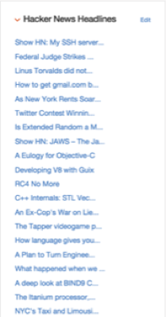

# Simple Website Scraper With Endpoint #

# Description #

This example presents an endpoint which returns data scraped from a news website and
a custom widget to display the results.

The HTML is scraped and the data cleaned up using the [Nokogiri gem](http://www.nokogiri.org/).

# What You Need #

You should be familiar with how to create endpoints and widgets in Application Builder.
Details of how to create a new endpoint can be found in the documentation under
[Developing Applications in Application Builder](http://automan-docs2.bigdatalab.ibm.com:9090/kc/api/content/SS8NLW_11.0.0/com.ibm.swg.im.infosphere.dataexpl.appbuilder.doc/c_de-ab-devapp.html) > [Creating endpoints for Application Builder](http://automan-docs2.bigdatalab.ibm.com:9090/kc/SS8NLW_11.0.0/com.ibm.swg.im.infosphere.dataexpl.appbuilder.doc/c_de-ab-devapp-endpoints.html)

The code presented is a mix of Ruby code and erb templates. Familiarity with Ruby development is helpful but not
required.

# Installation #

The code for the widget can be found in [widget.erb](widget.erb) and the endpoint code can be found
in [endpoint.erb](endpoint.erb).  The widget code expects the endpoint to be named `HackerNewsHeadlines`
and take no parameters.

# Use #

The widget should be added to a layout before it can be used.  This widget can be added to the home page 
and only depends on the endpoint described in [endpoint.erb](endpoint.erb).  
