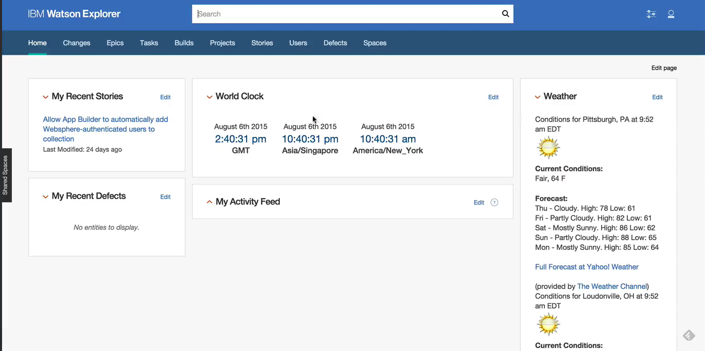

# Simple Website Scraper With Endpoint #

# Description and Use #

This example presents an endpoint that scrapes a website for news
items and then displays them in a list on the custom widget.  The HTML
is scraped using Nokogiri and cleaned up before returning that data
for use in the widget.

You can also see a quick (about 2 minutes) screencast on how to use install
and use this widget.

