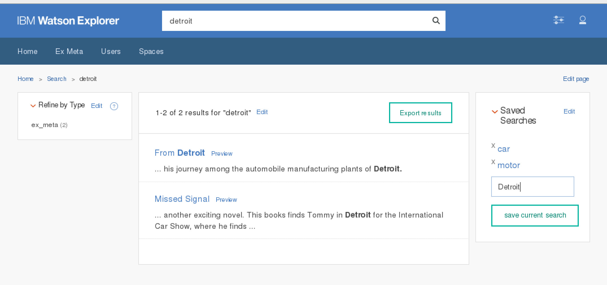

# Save Current Search Results Page widget #

# Description and Use #

This widget allows a user to save the current search results page to their user profile within Watson Explorer Application Builder. Users only see their own saved searches.

The intention is to save the current URL of a search page to the current user's profile. To achieve this we create a new store called current_user.properties["saved_searches"], which will store the data in the Apache ZooKeeper instance that is installed along with Application Builder. This property accepts a key/value pair. The key is a label defined by the user and the value is always the application's current URL. If the user enters a key that already exists, the current entry is updated.

We save the current relative URL and parameters. This allows the user to select refinements, pages, etc and save the exact state of the page they are on.

