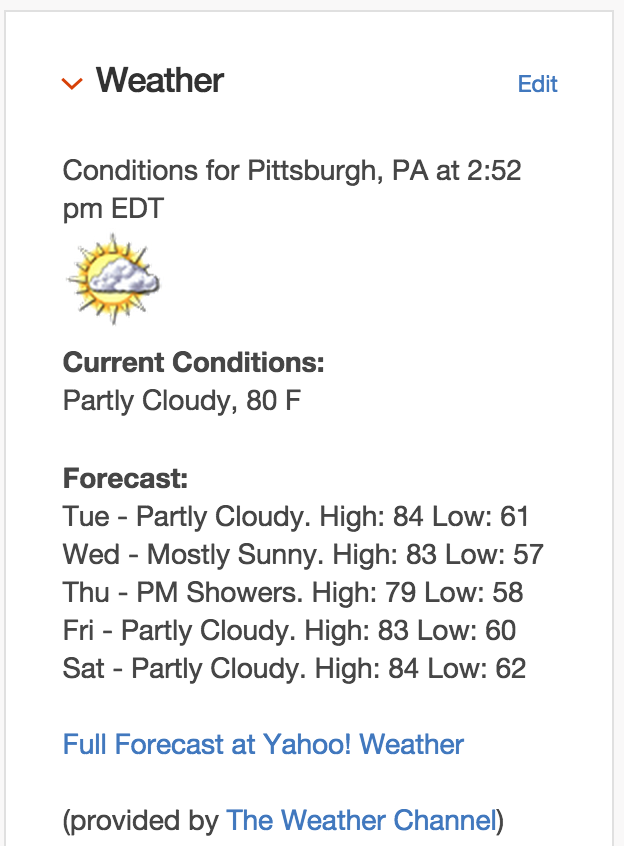

# Simple Weather Widget #

# Description and Use #

This simple weather widget does not require an endpoint. The widget relies on a `.weather` div
having a `data-zip` attribute.  The data attribute must be set
to the zipcode of the target location.  You may display more than one weather block, however an api
call will be made for each location which can impact load times.  

This widget gets the weather via a YQL query to the Yahoo! Weather API.