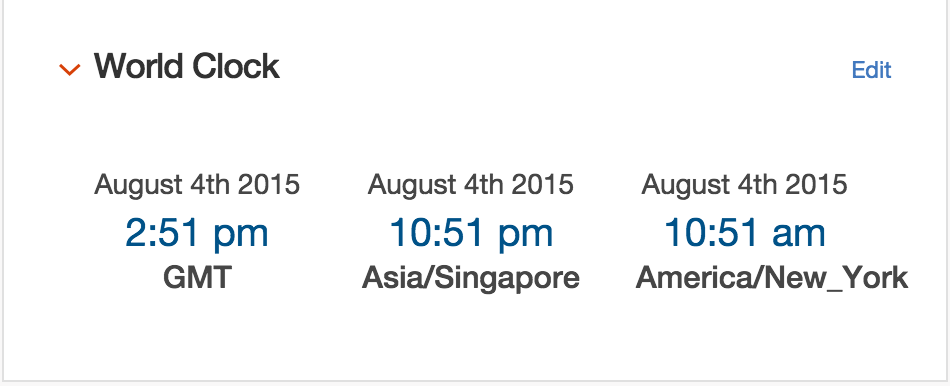

# World Clock #

# Description and Use #

A customer requested a world clock that showed three
time zones and updated every second.  This clock shows three
time zones, controlled via a `data-tz` data attribute on the `.clock`
div.

The code requires the  library (because
otherwise time code in JavaScript is a huge pain).

